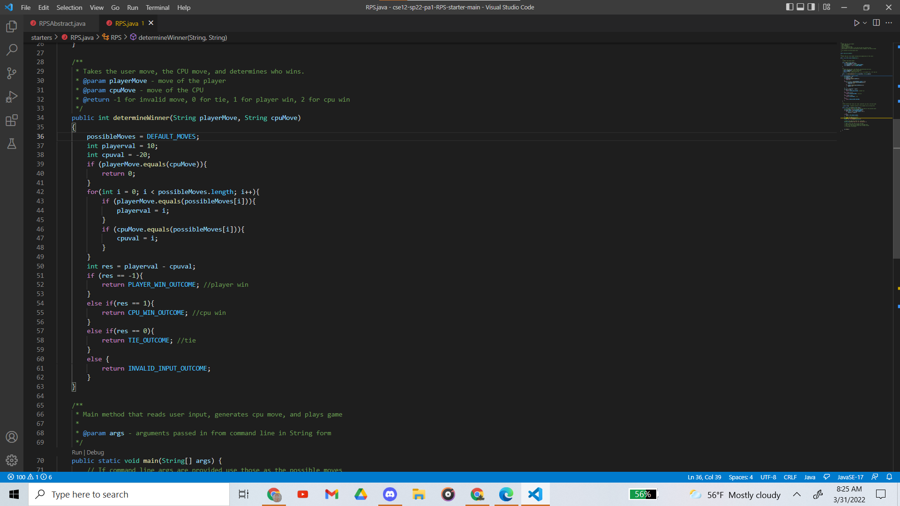
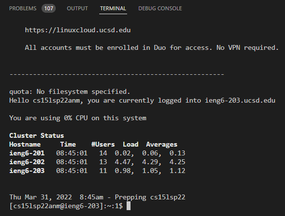
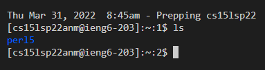
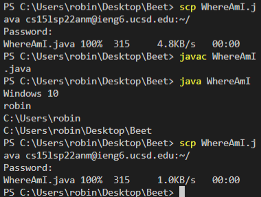
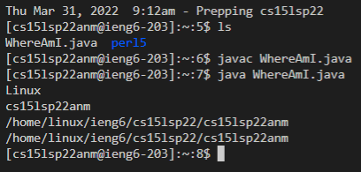
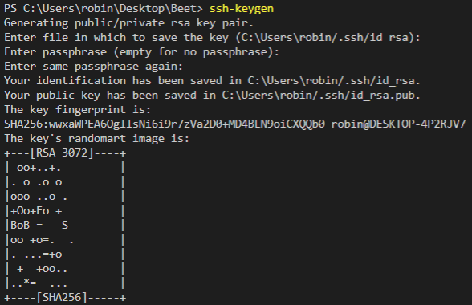
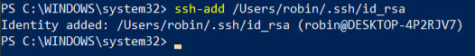
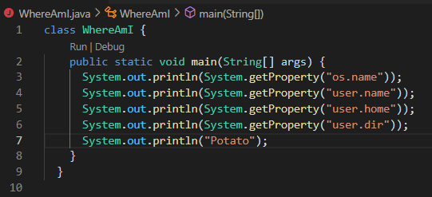
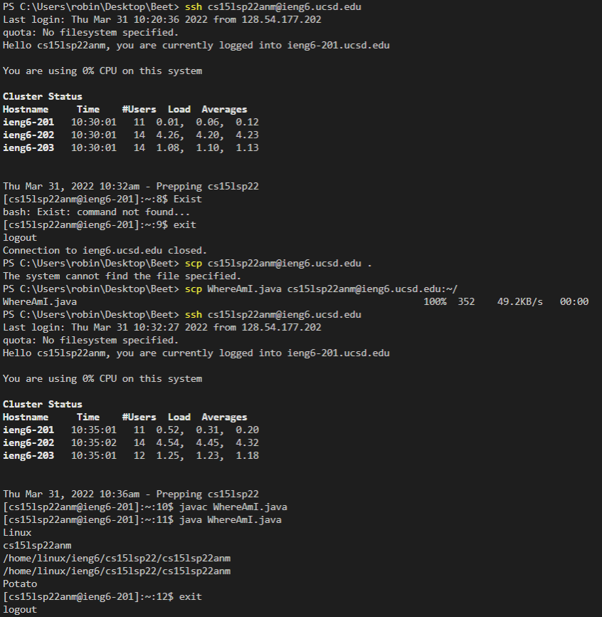

# CSE 15L Lab Report 1

# Step 1: Installing VScode
1. go to the VScode website
2. download VScode 
3. create cse15L folder somewhere on computer
4. go into terminal in VScode and cd to cse15L folder
5. should look like this(disregard code shown):



# Step 2: Remotely Connecting
1. install openSSH
2. find your cse15l account [here](https://sdacs.ucsd.edu/~icc/index.php)
3. open terminal in VScode and type: ```$ ssh cs15lsp22zz@ieng6.ucsd.edu ``` (NOTE: change letters after "2" and before "@" to ones shown in account lookup)
4. when prompted, type "yes"
5. now the the computer is connected to a computer in the CSE basement and commands can be remotely run



# Step 3: Run Some Commands
1. in terminal, type in "cd", "ls", "pwd" "mkdir" and "cp" on local computer and after sshing into basement computer
2. record any errors that occur



# Step 4: Move files over ssh using scp
1. open terminal on client computer and type ```scp```
2. make local file called ```WhereAmI.java``` and put
```  
class WhereAmI {
  public static void main(String[] args) {
    System.out.println(System.getProperty("os.name"));
    System.out.println(System.getProperty("user.name"));
    System.out.println(System.getProperty("user.home"));
    System.out.println(System.getProperty("user.dir"));
  }
}

```
3. make sure java is installed and run using ```javac``` and ```java```
4. transfer this file to basement computer using ```scp WhereAmI.java cs15lsp22zz@ieng6.ucsd.edu:~/```
5. enter password for your account
6. ssh into basement computer and use ```ls``` which should show the transfered file
7. run the file while logged into basement computer using ```javac``` and ```java```




# Step 5: SSH Keys
This step will allow the basement computer to recognize your specific computer so you can get access without entering a password everytime.
1. run on your computer: 
```
# on client (your computer)
$ ssh-keygen
Generating public/private rsa key pair.
Enter file in which to save the key (/Users/<user-name>/.ssh/id_rsa): /Users/<user-name>/.ssh/id_rsa
Enter passphrase (empty for no passphrase): 
```
**LEAVE PASSPHRASE EMPTY**
```
Enter same passphrase again: 
Your identification has been saved in /Users/<user-name>/.ssh/id_rsa.
Your public key has been saved in /Users/<user-name>/.ssh/id_rsa.pub.
The key fingerprint is:
SHA256:jZaZH6fI8E2I1D35hnvGeBePQ4ELOf2Ge+G0XknoXp0 <user-name>@<system>.local
The key's randomart image is:
+---[RSA 3072]----+
|                 |
|       . . + .   |
|      . . B o .  |
|     . . B * +.. |
|      o S = *.B. |
|       = = O.*.*+|
|        + * *.BE+|
|           +.+.o |
|             ..  |
+----[SHA256]-----+
```
 <br/>


2. record the 3 letters that show up at the top of the picture (in this case it's "RSA")
3. to set up windows, go to command prompt and run as administrator
4. type ```ssh-add /Users/**your name**/.ssh/id_**the 3 letters as lowercase**```


# Step 6: Make Remote Running Easier
This is the last step and is mostly a test to see if all the previous work functions correctly
1. ssh into basement computer and search directories using ```$ ssh cs15lsp22zz@ieng6.ucsd.edu "ls"```
2. run multiple commands in one line by separating them using semi colons ```$ cp WhereAmI.java OtherMain.java; javac OtherMain.java; java WhereAmI```
**NOTE: THERE ARE NO OTHER FILES SO ```OtherMain.java``` DOESN'T EXIST YET**
3. up arrow will bring back previous commands



Finished!
