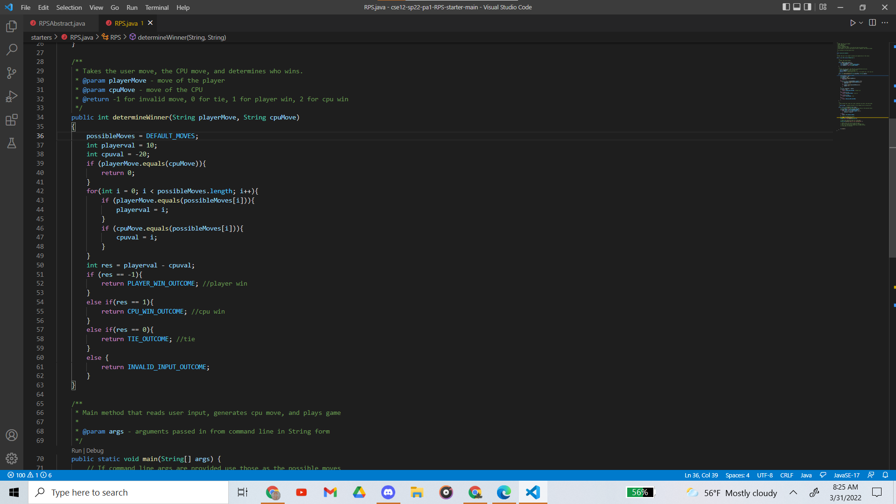

# CSE 15L Lab Report 1

# Step 1: Installing VScode
1. go to the VScode website
2. download VScode 
3. create cse15L folder somewhere on computer
4. go into terminal in VScode and cd to cse15L folder
5. should look like this:



# Step 2: Remotely Connecting
1. install openSSH
2. find your cse15l account [here](https://sdacs.ucsd.edu/~icc/index.php)
3. open terminal in VScode and type: ```$ ssh cs15lsp22zz@ieng6.ucsd.edu ```
