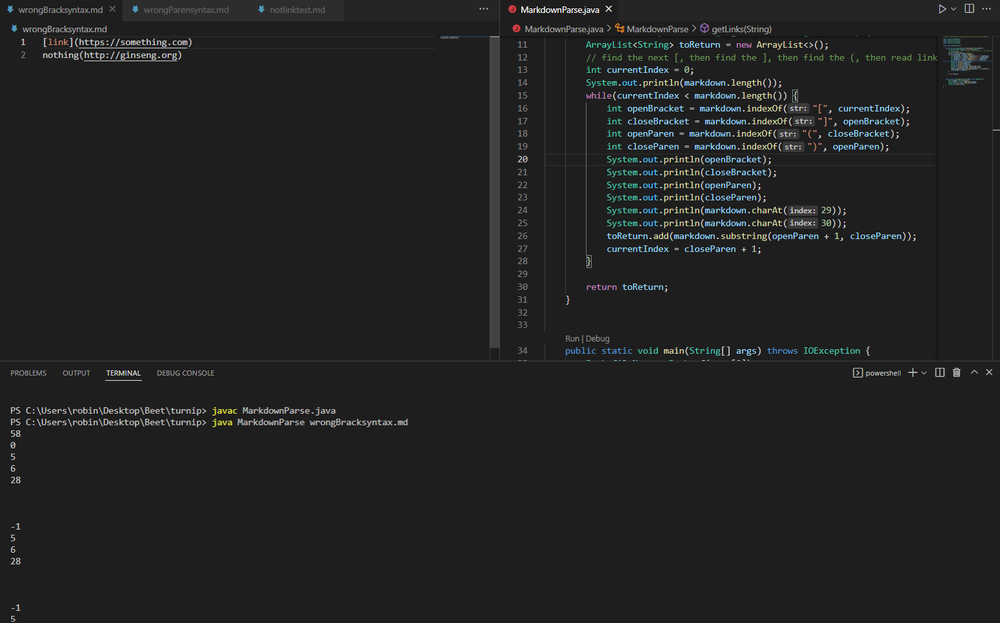

# Lab Report 2 - Week 4
## Errors/Fixes for MardownParse.java

### Fix 1: Filtering out images and other non-link types
The first fix involved removing non-link type inputs such as images and pdfs.
  
The test file that caused this problem can be found [here](https://github.com/Potato0112/markdown-parser/blob/main/notlinktest.md).  
  
The symptom of the bug is that non-link type inputs such as images and pdfs are being included in the output.  
  
The symptom caused by the failure inducing input is pretty easy to identify. The code has not way of differentiating types of inputs so if `[]` and `()` syntax is correct, the `(content)` will be included regardless of type. This can be fixed by extracting the file name string between the `()` and checking if it contains any non link extensions such as `.png `, `.jpg`, `.jpeg`, or `.pdf` stored in an array of non-link extensions.

### Fix 2: Ignoring Invalid `[]` Causing Infinite Loops
The second fix involves skipping over any input that doesn't contain `[]` around the link name.
  
The test file that caused this problem can be found[here](https://github.com/Potato0112/markdown-parser/blob/main/wrongBracksyntax.md).  
  
The symptom of the bug is that an infinite loop reading the same first line over and over again.
  
  
