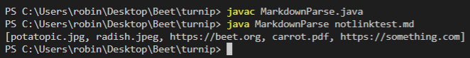
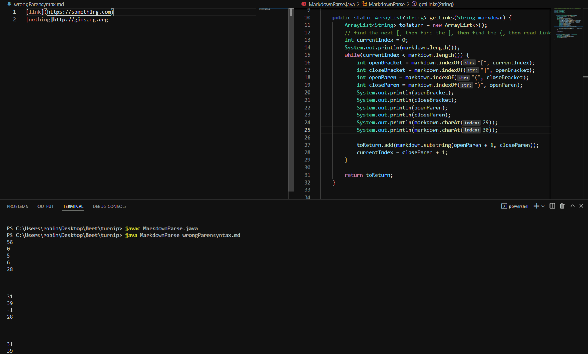
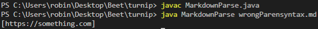

# Lab Report 2 - Week 4
## Errors/Fixes for MardownParse.java

### Fix 1: Filtering out images and other non-link types
The first fix involved removing non-link type inputs such as images and pdfs.
  
The test file that caused this problem can be found [here](https://github.com/Potato0112/markdown-parser/blob/main/notlinktest.md).  
  
The symptom of the bug is that non-link type inputs such as images and pdfs are being included in the output.  
  
The symptom caused by the failure inducing input is pretty easy to identify. The code has not way of differentiating types of inputs so if `[]` and `()` syntax is correct, the `(content)` will be included regardless of type. This can be fixed by extracting the file name string between the `()` and checking if it contains any non link extensions such as `.png `, `.jpg`, `.jpeg`, or `.pdf` stored in an array of non-link extensions.  

### Fix 2: Ignoring Invalid `()` Causing Infinite Loops
The second fix invloves skipping over any input that does't contain `()` around the link.
  
The test file that caused this problem can be found [here](https://github.com/Potato0112/markdown-parser/blob/main/wrongParensyntax.md).  
  
The symptom of the bug is an infinite loop reading the first line.
  
Using print statements, it is clear that `openBracket`, `closeBracket`, `openParen`, and `closeParen` are being assigned the same values.
  
The symptom caused by the failure inducing input is a bit trickier to figure out. From the print statements, when there are no `()` left in the input string, `openParen` is set to -1 which results in `closeParen` getting set to 28(the `)` at the end of the first line), causing the next loop to once again find no `(` and repeating the process in an infinite loop. This can be fixed by checking if the `openParen` or `closeParen` are set to -1 and if so, break out of the loop.  
  

### Fix 3: Ignoring Invalid `[]` Causing Infinite Loops
The final fix involves skipping over any input that doesn't contain `[]` around the link name.
  
The test file that caused this problem can be found [here](https://github.com/Potato0112/markdown-parser/blob/main/wrongBracksyntax.md).  
  
The symptom of the bug is that an infinite loop reading the same first line over and over again.
  
In this more indepth look at the output, the values for `openBracket`, `closeBracket`, `openParen`, and `closeParen` are looping forever which gives hints as to why this bug is occuring.
  
The symptom caused by the failure inducing input is nearly identical to Fix 2. From the indepth output, when there are no more `[]` left in the string, searching for the next `]` using `markdown.indexOf(closeBracket)` returns -1 and because `currentIndex`'s value is updated by the index of `closeBracket`, -1+1 is perpetually 0 and lower than `markdown.length()` thus creating an infinite `while` loop. This can be fixed by checking if the `openBracket` or `closeBracket` are set to -1 and if so, break out of the loop.
  

Finished!
