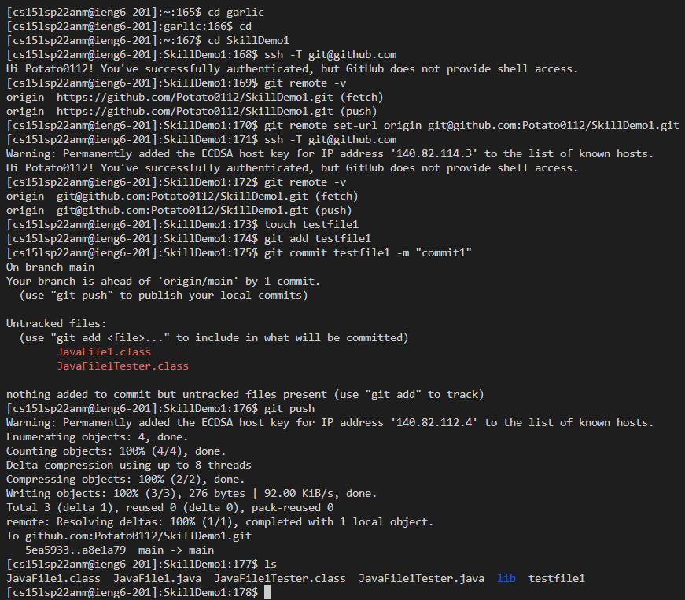
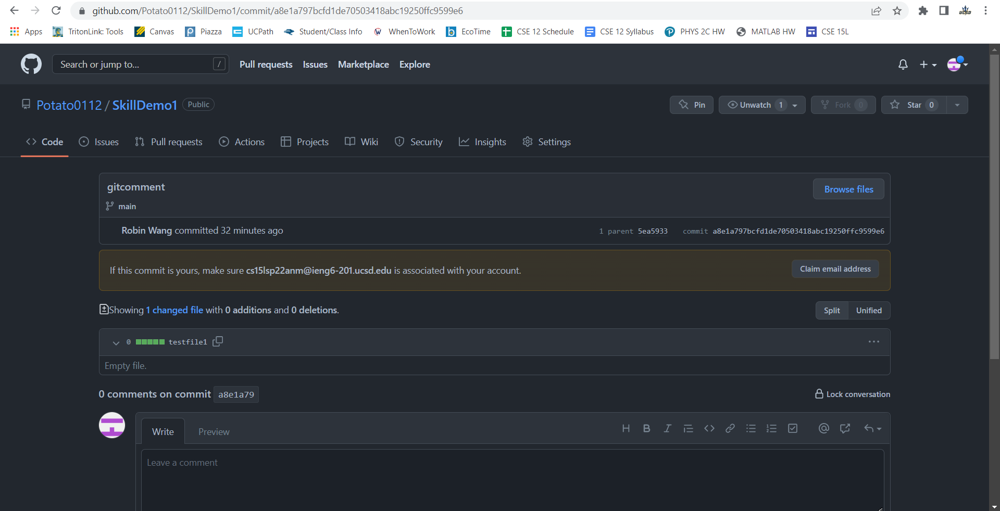
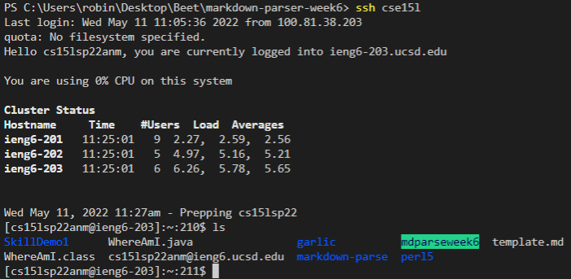
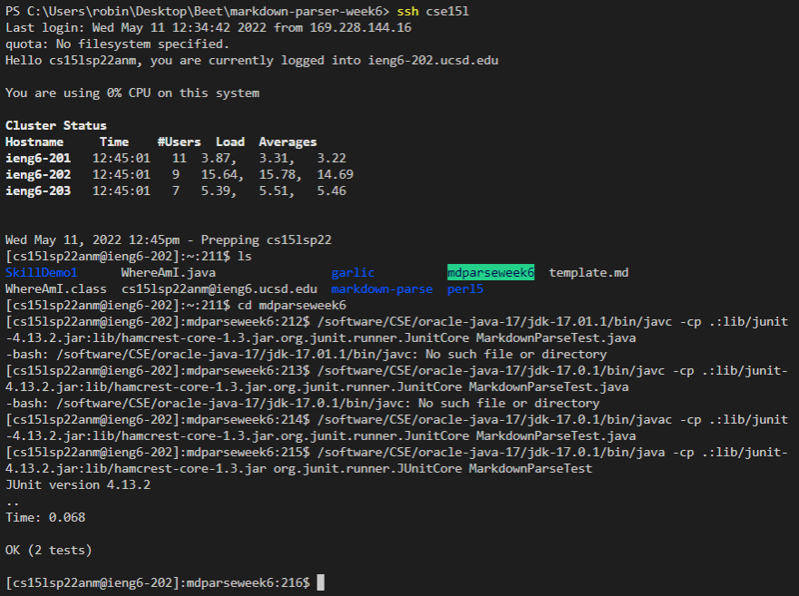
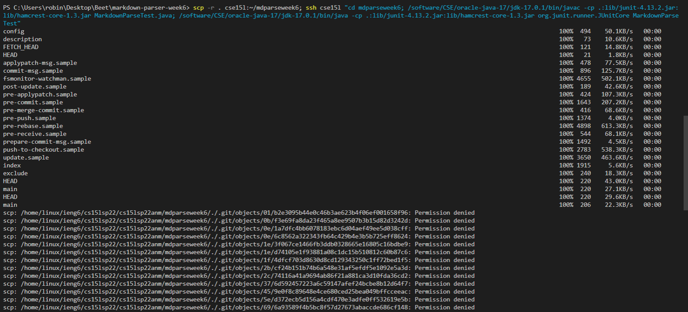
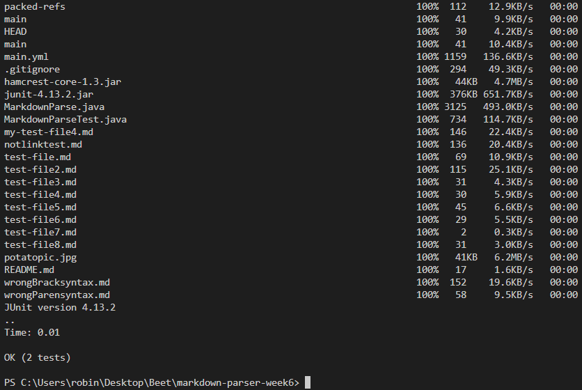

# Lab Report 3 - Week 6
## Streamlining ssh Configureation

Because typing the entire ssh name can be hard to remember, a good way to streamline the process is to simplify the name. This can be done through the configuration file located at `~/.ssh/config`.  
The first step is to install the VS code SSH extension. It should appear as a new icon on the left side of the window.  
.png)  
Select the SSH Target. In this case, it's the ieng6 server.  
.png)  
Click the gear icon.  
.png)  
Go to the search bar and from the drop down, select the option that ends with `~/.ssh/config`.  
.png)  
Edit the `config` file by changing the `Host` name to something shorter like `ieng6`. As you can see, after changing the `Host` name, it's possible to use the new name to ssh into the server using `ssh ieng6`.  
.png)  
It is also possible to use the new simplified name to move files to the server using `scp (FILE NAME) ieng6`.  
.png)  
##Setup Github Access from ieng6
The next task involves adding a key for Github.
The first step is to copy the public key and paste it into github. In the top right of the home page, click the profile picture, click the ssh tab on the left, click the **New SSH Key** button, name the key, paste the public key, and save.  
.png)  
Now that the key is saved, find the private key's location. The key is located inside the `.ssh` folder in the `id_rsa` file. Typing `more id_rsa` will reveal what the key is so that will not be done for privacy.
.png)
The next step is to log into the ieng6 server to commit and push a change to github. For window's users, it is important to use the next line `git remote set-url origin git@github.com:**Github Username**/**File Name**.git` In order to properly connect to github. Then, ssh into github and check that it successfully authenticates. Also verify with `git remove -v`. Create a file with `touch **File Name Here**`, add the file with `git add **File Name Here**`, commit the change with `git commit **File Name Here** -m "**Commit Name Here**"`, and finally, push to origin with `git push`. 
  
You can check that the file has been pushed to github by going into the directory's commit history to see the [Link](https://github.com/Potato0112/SkillDemo1/commit/a8e1a797bcfd1de70503418abc19250ffc9599e6). 

## Copy whole directories with `scp -r`
The first step is to go into terminal and navigate to the markdown-parser location on the desktop. In the terminal, type the command `scp -r . **SSH Name**:~/**Name of Repo**`. The `.` after `-r` means to copy the current file. The name after the `/` is the name of the directory on the ieng6 server this file will be copied to. If the name doesn't already exist, a new directory will be made.
.png)
After everything is done being copied, log into the ieng6 server using `ls**` and you should see all the files including the new directory.  

You can manually run the `MarkdownParseTest` java file by compiling it with `javac` and running it with `java`. However, to prevent java version errors, you must replace `javac` with `/software/CSE/oracle-java-17/jdk-17.0.1/bin/javac` and `java` with `/software/CSE/oracle-java-17/jdk-17.0.1/bin/java`.  
  
Finally, run a combined command that `scp` the file onto ieng6, compliles it, and runs it using `;`. It is important that when doing this, to type the entire path to `javac -cp` and `java -cp` so that no version errors are thrown.  

Finished
