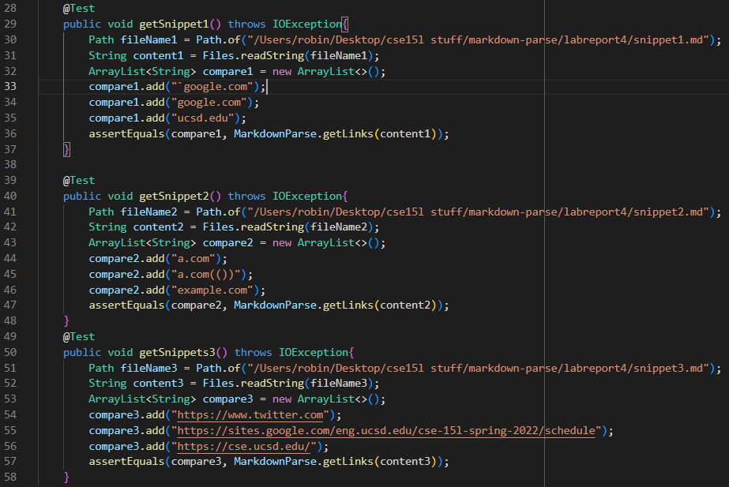
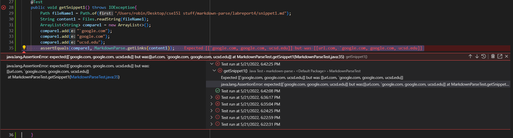
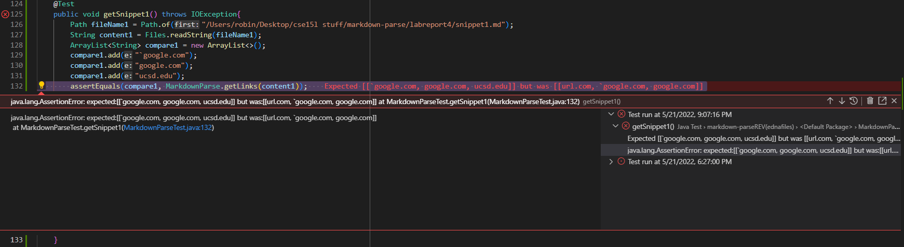
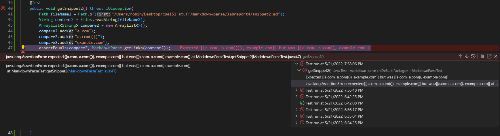
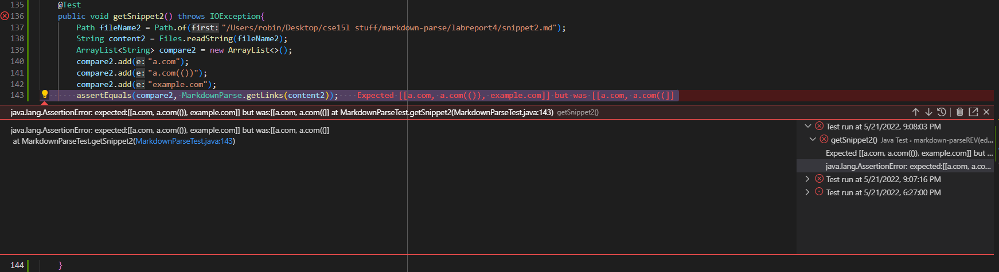
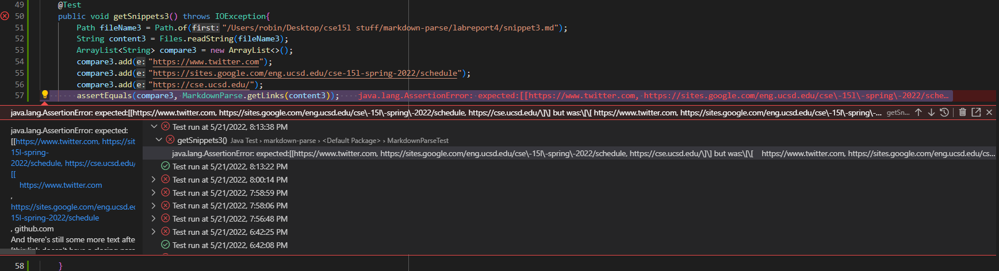
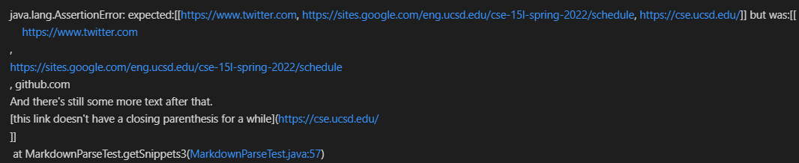
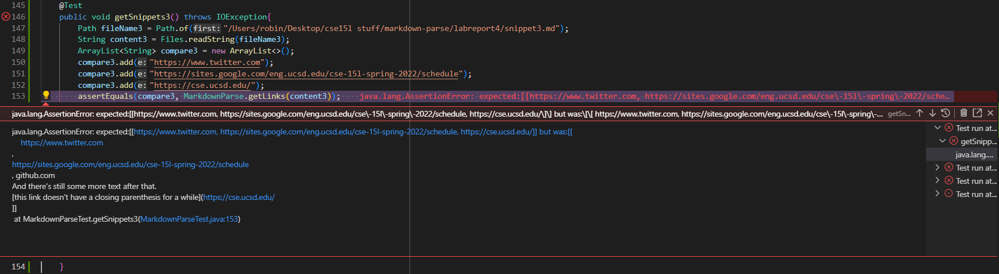

# Lab Report 4 - Week 8

[my implementation](https://github.com/Potato0112/markdown-parser)  
[reviewed implementation](https://github.com/ednavho/ednafiles)  

**Note: All expected values obtained from VS code preview of test files.**

These are the tests created for **BOTH** the reviewed implementation and my implementation of `markdown-parser`.  
  

## Snippet 1  
In the first test, the expected value should be `['google.com, google.com, ucsd.edu]`.
My test case resulted in:  
  
The reviewed case resulted in:   
  
I don't think this is going to be an easy fix as the test revealed multiple problems, specifically line one's inclusion despite improper `[]` syntax and line four's exclusion despite correct syntax. The first line included `url.com` despite not having complete brackets due to comment syntax while the fourth line excluded `ucsd.edu` due to it not choosing the outermost set of `[]`. Fixing this error would require the code to be able to detect comment syntax and select only the outer most `[]`, both of which do not seem to be quick fixes.

## Snippet 2  
In the second test case, the expected value should be `[a.com, a.com(()), example.com]`  
My test case resulted in:  
  
The reviewed case resulted in:  
  
I don't think this is going to be an easy fix as it shares many similar characteristics as snippet 1 resulting in erros in line two and three. The second line printed `a.com((` instead of `a.com(())` due to the cod terminating when it found the first `)` while the third line excluded `example.com` due to finding the first `]` and finding no `(` immediately after that. Fixing this error would require the code to be able to detect the outermost set of `[]` as well as check if the string contained in the outermost `[]` contains a valid link syntax.  

## Snippet 3  
In the third test case, the expected value should be `[https://twitter.com/, https://sites.google.com/eng.ucsd.edu/cse-15l-spring-2022/schedule, https://cse.ucsd.edu/]`  
My test case resulted in:  
  
Due to the long error message, here is a standalone shot of the entire message:  
  
The reviewed case resulted in:  
  
I don't think this is going to be an easy fix as it requires the there are many different scenarios of this problem that require major changes to account for. The extra text in the index 2 was because the code didn't detect a `)` so it included everything from `github.com` to `https://cse.ucsd.edu/`. Fixing this error would require the code to detect that there is a syntax error with `)` triggered by the start of the next valid `[]` and `()`.

Finished
