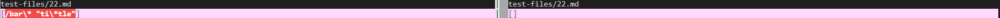
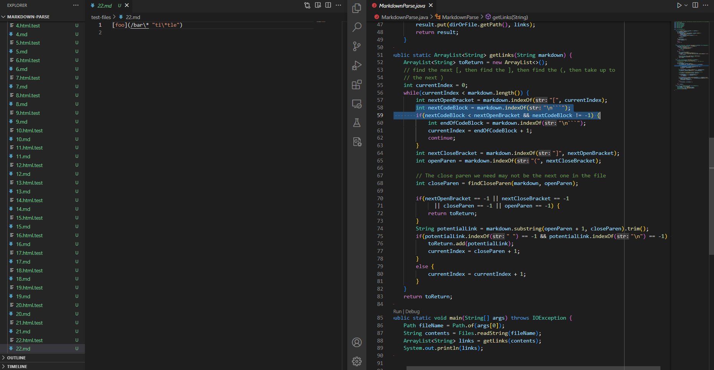
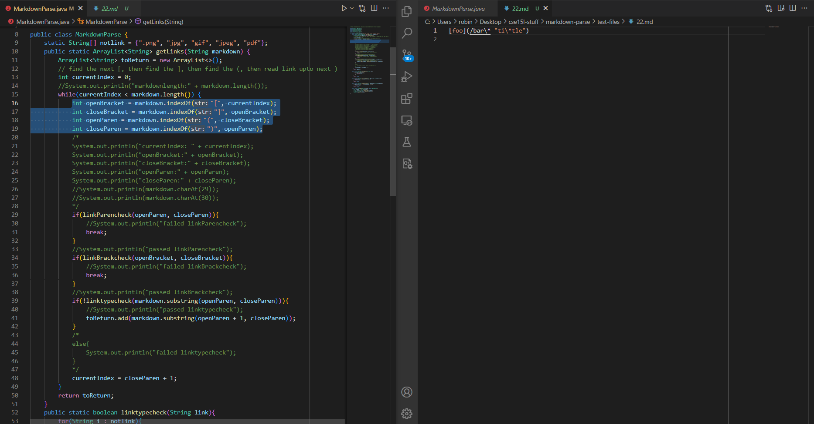
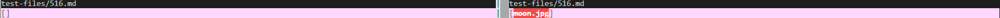
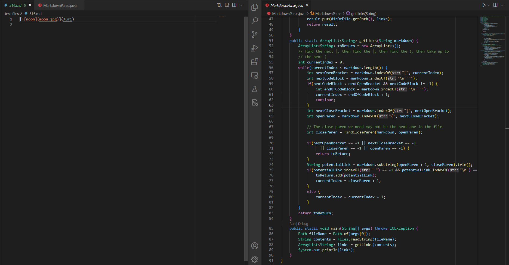

# Lab Report 5 - Week 10
## Setup
For all images, my code is on the left and the provided code is on the right.
In order to compare my code's output with the provided code's output, I need to set up a bash script that will automatically run through each of the hundreds of test files and output the result onto a txt file. To do this, I cloned the provided repository to ieng6 and scped my edited respositry (with `test-files` and `script.sh` added) to ieng6. Once there, I went into each repository and used vim to edit the `script.sh` file to include a `echo $file` above the run command. This allows me to see the names of the tests that failed. After that, I ran both bash files to obtain two txt files containing the outputs of each code version. Finally, using `vimdiff markdown-parse/results.txt cs15lsp22-markdown-parser/results.txt`, I can see side by side which tests are highlighted and therefore, gave different results. The bugs below are selected from that list.
## Bug 1
The first bug occured in file 22. If we are just going by the basic syntax, my code is correct.

My code returned `[/bar\* "ti\*tle"]` while the provided code returned nothing.  
This image shows the part of the provided code that causes nothing to be returned. 
  
My code simply looks for a start bracket, end bracket, start parenthesis, and end parenthesis and if all elements are present, then the string is accepted.  
  
This bug is due to the provided code searching for `\n` in the potential link string while mine simply returns the string as long as it conforms to the correct `()` and `[]` syntax. When the provided code compared `nextCodeBlock`, it gave -1 which caused the `if` statement to advance the index and thus returning nothing. My code found all of the bracket/parenthesis syntax so it simply returned the content inside the parenthesis.
## Bug 2
The second bug occured in file 516. In this case, both code is wrong. The correct output should be `/uri`.  
 
My code returned nothing while the provided code returned [moon.jpg].  
This image shows the part of the provided code that cause `moon.jpg` to be outputted.  
  
This image shows the part of the provided code that caused nothing to be outputted.  
This bug is due to  both code improperly creating the potential link string and the provide code's function to find nexted links. My code searches for the first instances of `[]` and `()` so it used the first `[`, the `]` after "moon", the `(` immediately after `]`, and the `)` after "jpg". Thus the resulting string is `moon.jpg` which is omitted due to having `jpg` in the string. The provided code, does the same formatting but does not check for file type so returns `moon.jpg`.
Finished

